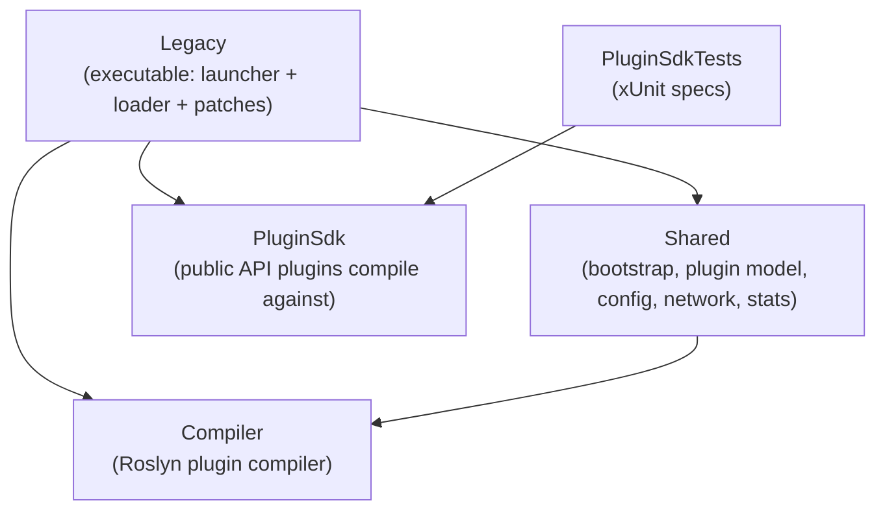
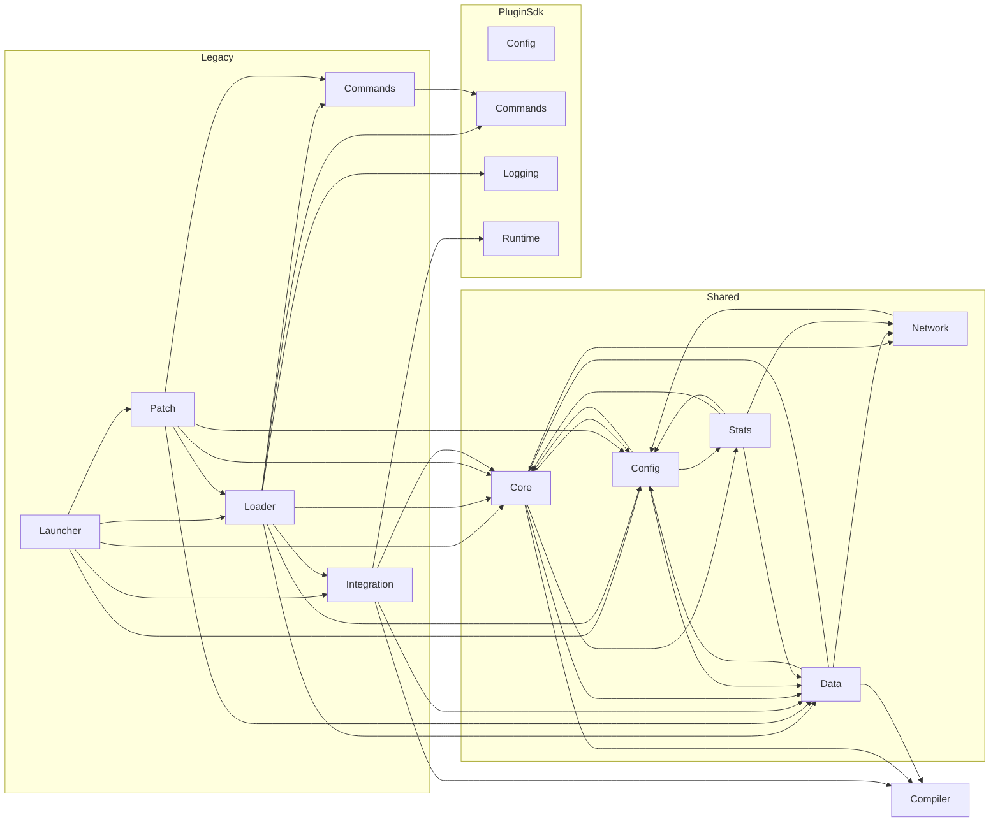

# Magnetar — Code Handbook

A structured, navigable reference for the **Magnetar** source tree. Magnetar is
a plugin and mod loader for the **Space Engineers (SE1) Dedicated Server**, a
hard fork of [Pulsar](https://github.com/SpaceGT/Pulsar) (hence the `Pulsar.*`
namespaces) adapted to run the headless DS on both Windows (.NET Framework 4.8,
the **Legacy** launcher) and Linux/.NET 10 (the **Interim** launcher) — no
WinForms, no Telerik UI, no Windows-service host.

> This handbook is generated from the source by the `structured-documentation`
> skill. It is regenerable and incremental: see [data/README.md](data/README.md).
> For the *plugin-author* view of the public API, read the
> **[`se-dev-plugin-sdk`](../skills/se-dev-plugin-sdk/SKILL.md)** skill handbook;
> this handbook instead documents Magnetar's own internals file-by-file.

## How to read this handbook

Progressive disclosure, three levels deep:

1. **This page (`TOC.md`)** — project overview, architecture, and the module catalog.
2. **Module docs (`modules/*.md`)** — one per subsystem: purpose, key types, the
   full file list, public API surface, and inter-module dependencies.
3. **File descriptions (`descriptions/**/*.cs.md`)** — one per source file: a
   summary, every type with its fields/properties/methods/events, and
   `Uses` / `Used by` cross-references.

Need a flat list instead? **[`Index.md`](Index.md)** lists every documented
file with its module, tier, and one-line summary.

Related docs that already exist (kept as-is):

- **[`Build.md`](Build.md)** — per-platform build, dependency staging, publishing, and build-time overrides.
- **[`../README.md`](../README.md)** — install, usage, configuration, environment variables.
- **[`../skills/se-dev-plugin-sdk/`](../skills/se-dev-plugin-sdk/SKILL.md)** — plugin-developer handbook for `PluginSdk`.

## Architecture at a glance

Magnetar ships two executables built from one solution. Both replace
`SpaceEngineersDedicated.exe` and, before the game's own `Main` runs, resolve
the DS install, apply preloader Harmony patches, compile and load enabled
plugins, then hand off to the dedicated server.

| Executable | Target | Platform | Assembly |
| ---------- | ------ | -------- | -------- |
| **MagnetarLegacy** | .NET Framework 4.8 | Windows only | `Legacy.csproj` (net48) |
| **MagnetarInterim** | .NET 10 | Windows + Linux | `Legacy.csproj` (net10.0) |

The code is organised into five .NET projects. Their compile-time reference
direction (a strict DAG) is the backbone of the module layering below:

`Compiler` and `PluginSdk` are leaves (no project references). `Shared` builds on
`Compiler`. `Legacy` sits on top of everything and is the only executable.

### Launch sequence (high level)

1. **Native bootstrap** (Linux) — `NativeLibraryPreloader` dlopens bundled `.so`
   files and aliases Windows DLL names. *(Legacy.Loader)*
2. **Preloader patches** — `Preloader` applies the early Harmony patches that
   redirect paths and intercept DS startup. *(Shared.Core, Legacy.Patch)*
3. **Resolve install & config** — locate the DS, read `CoreConfig` and the active
   `Profile`, build the `PluginList`. *(Legacy.Launcher, Shared.Config, Shared.Core, Shared.Data)*
4. **Acquire plugins** — download from GitHub/NuGet, fetch Steam Workshop mods,
   resolve dependencies. *(Shared.Network, Shared.Data, Legacy.Loader)*
5. **Compile** — Roslyn compiles source plugins in an isolated context, with
   publicized SE assemblies as references. *(Compiler, Legacy.Integration)*
6. **Load & run** — `PluginLoader` instantiates each plugin, injects services,
   registers SE components, wires the chat-command pipeline, then drives the SE
   plugin lifecycle. *(Legacy.Loader, Legacy.Commands, PluginSdk.*)*
7. **Hand off** to the dedicated server's own `Main`.

## Module catalog

Grouped by project. Click a module for its full doc.

### `Legacy` — the launcher executable

| Module | Files | Lines | What it does |
| ------ | ----- | ----- | ------------ |
| [Legacy.Launcher](modules/Legacy.Launcher.md) | 4 | 1197 | Launcher bootstrap & entry point: argument parsing, DS detection, environment setup, and handoff to the game's `Main`. |
| [Legacy.Loader](modules/Legacy.Loader.md) | 5 | 932 | Runtime plugin host & native bootstrap: instantiates plugins, drives their SE lifecycle, registers components, preloads native libs. |
| [Legacy.Patch](modules/Legacy.Patch.md) | 11 | 488 | All Harmony patches that adapt the DS binary to Magnetar's headless, in-process, externally-configured hosting model. |
| [Legacy.Commands](modules/Legacy.Commands.md) | 3 | 196 | Host side of the `!`-prefixed chat-command pipeline and the built-in `!save` / `!restart` / `!quit` commands. |
| [Legacy.Integration](modules/Legacy.Integration.md) | 6 | 471 | Glue to SE internals: isolated Roslyn compilation host and Linux case-insensitive path resolution. |

### `Shared` — cross-target infrastructure

| Module | Files | Lines | What it does |
| ------ | ----- | ----- | ------------ |
| [Shared.Core](modules/Shared.Core.md) | 11 | 2064 | Core bootstrap layer: preloader, plugin list, updater, Steam helpers, assembly resolution, shared tools. |
| [Shared.Data](modules/Shared.Data.md) | 10 | 1685 | The plugin-entry data model (GitHub / local-folder / local / mod / obsolete plugins, profiles, status). |
| [Shared.Config](modules/Shared.Config.md) | 12 | 521 | All persistent installation configuration: core config, profiles, and plugin sources. |
| [Shared.Network](modules/Shared.Network.md) | 7 | 864 | Outbound network I/O: GitHub REST/CDN, a full NuGet v3 client, and a lightweight HTTP façade. |
| [Shared.Stats](modules/Shared.Stats.md) | 6 | 190 | Opt-in client-side telemetry and community plugin-rating layer. |

### `Compiler` — the plugin compiler

| Module | Files | Lines | What it does |
| ------ | ----- | ----- | ------------ |
| [Compiler](modules/Compiler.md) | 5 | 562 | In-process Roslyn compiler that builds SE plugins from source, resolving and publicizing the SE assembly closure as references. |

### `PluginSdk` — the public plugin API

| Module | Files | Lines | What it does |
| ------ | ----- | ----- | ------------ |
| [PluginSdk.Config](modules/PluginSdk.Config.md) | 5 | 1817 | Declarative, attribute-driven plugin configuration → local XML, remote JSON envelope, and Quasar UI schema. |
| [PluginSdk.Commands](modules/PluginSdk.Commands.md) | 17 | 1226 | The chat-command framework: attribute-declared handlers, registry, dispatcher, argument binding, permissions. |
| [PluginSdk.Logging](modules/PluginSdk.Logging.md) | 8 | 391 | Unified, environment-agnostic logging API (game log standalone, structured JSON under Quasar). |
| [PluginSdk.Runtime](modules/PluginSdk.Runtime.md) | 5 | 353 | Host-agnostic path resolution and dedicated-server lifecycle control (`ServerControl`). |

### `PluginSdkTests` — specifications

| Module | Files | Lines | What it does |
| ------ | ----- | ----- | ------------ |
| [PluginSdkTests](modules/PluginSdkTests.md) | 8 | 2261 | xUnit tests that specify and regression-guard every public `PluginSdk` API. |

## Module dependency graph

Precise inter-module edges (within the project-reference DAG above). Each module
doc also lists its own `Uses` / `Used by` modules.

---

**[Full file index ▶](Index.md)** · 16 modules · 123 source files · ~12.7k lines
